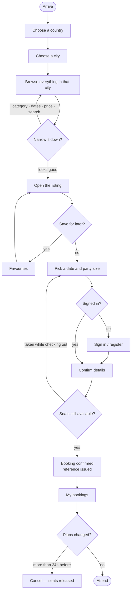
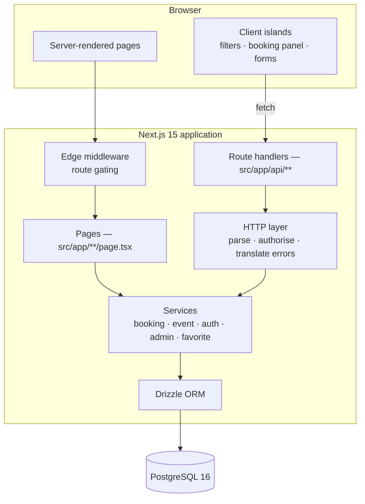

<div align="center">

# Eventora

**Find everything happening in a city — and book it.**

A full-stack events and activities discovery and booking platform.
Country → city → filtered results → dated booking, with an administrative
dashboard behind it.

**▶ [Live demo](https://eventora12.netlify.app/)** — deployed on Netlify with a
PostgreSQL database and the standard demo dataset. Sign in with the
[demonstration accounts](#demonstration-accounts) to try booking and the admin
dashboard.

[](https://github.com/manarzamil/Eventora/actions/workflows/ci.yml)


</div>


---

> ### ⚠️ Demonstration data
>
> Eventora is an academic Web Engineering project. The countries, cities and
> venues are real places, but **every event listing, price, schedule, capacity,
> review and user account is fictional data written for this project.** Nothing
> is connected to a ticketing provider, no listing represents genuine
> availability, no payment is ever taken, and no data is scraped from or
> synchronised with any third-party service. The same disclosure appears in the
> footer of every page in the running application.

---

## Contents

[Overview](#overview) · [Why it exists](#why-it-exists) · [Features](#features) ·
[Booking, transactions and overbooking](#booking-transactions-and-overbooking) ·
[Security](#security) · [Architecture](#architecture) · [Tech stack](#tech-stack) ·
[Database](#database) · [API](#api) · [Getting started](#getting-started) ·
[Testing](#testing) · [Screenshots](#screenshots) ·
[Project structure](#project-structure) · [Engineering decisions](#engineering-decisions) ·
[Limitations and roadmap](#limitations-and-roadmap) · [License](#license)

---

## Overview

Eventora is a discovery and booking platform for events and activities. You pick
a **country**, then a **city**, and from there everything — prices, times,
categories, availability — is scoped to that one place, in its own currency and
its own time zone.

The unit of availability is the **dated session**, not the listing, so a dhow
cruise that sails four evenings a week is one listing with its own capacity per
date. Seats are claimed inside a database transaction, which is the part of this
build most worth reading:
[booking, transactions and overbooking](#booking-transactions-and-overbooking).

| | |
|---|---|
| **Stack** | Next.js 15 · React 19 · TypeScript (strict) · PostgreSQL 16 · Drizzle ORM · Tailwind v4 |
| **Size** | ~13,500 lines in `src/` · 25 pages · 29 REST endpoints · 10 tables |
| **Tests** | 138, all passing, against a real PostgreSQL instance in CI |
| **Seed data** | 5 countries · 15 cities · 81 venues · 89 events · ~3,300 sessions |

Built from an empty directory as a portfolio project, and complete rather than a
mock-up: a real relational schema with versioned migrations, hand-rolled
authentication with role-based access control, and an administrative dashboard
with full CRUD.

---

## Why it exists

Finding out what is actually on in a city is a solved problem for flights and
hotels and an unsolved one for everything else. Listings are scattered across a
venue Instagram account, a ticketing site that only carries arena shows and a
poster in a café window; nothing is organised by *where you are*; and a listing
that says "Fridays at sunset" never says whether this Friday has space. A small
operator running a weekly workshop has no realistic route to an audience at all.

| Problem | How Eventora answers it |
|---|---|
| Fragmented discovery | One catalogue, ten categories, full-text search across titles, tags, venues and cities. |
| Locality as an afterthought | Country → city is the first interaction, before any results are fetched. Everything downstream inherits that scope. |
| Opaque availability | Each listing carries its own dated sessions with live remaining capacity. A sold-out date is visibly sold out; a nearly-full one says how many places are left. |
| Multi-country complexity | Currency and IANA time zone are modelled per country and per city. Money is stored in integer minor units with the exponent read from `Intl` — so `KD 18.000` and `£18.50` are both right. Times are shown in the zone of the event, never that of the viewer. |
| No route to market for organisers | An administrative dashboard where events, dates, capacity, pricing and taxonomy are all editable, with statistics on what is selling. |

---

## Features

**Discovery** — country → city as the entry point, with the city list narrowing
client-side once a country is chosen. PostgreSQL full-text search over title and
summary, plus pattern matching across tags, venue names and city names.
Multi-select category filters with live facet counts, a date window, a price
range and free-entry-only, and five sort orders. All filter state lives in the
URL, so a filtered view is a link you can send to someone.

**Booking** — an event page with full description, gallery, practical details,
venue with a map link, up to 60 upcoming dates and reviews. Pick a date and a
party size (the stepper is bounded by both the per-booking limit and the seats
actually left), confirm pre-filled details, receive a reference. Every booking is
then in one place, grouped into upcoming, past and cancelled, with a 24-hour
cancellation window that returns seats to inventory immediately. Favourites use
an optimistic toggle that reverts on failure.

**Accounts** — registration, sign-in, profile editing and password change on
hand-rolled sessions; see [Security](#security).

**Administration** — published and draft counts, bookings, users, average
occupancy, a 14-day booking chart, revenue grouped by currency and most-booked
events. Full CRUD on events, on sessions (dates with individual capacity and
optional price overrides), on countries, cities and venues, and on categories.
Bookings are searchable by reference, guest, e-mail or event, and roles are
managed from the dashboard. Guards throughout: deletes refuse to orphan data, an
event with bookings is archived rather than deleted, and the last administrator
can be neither demoted nor self-demoted.

**Throughout** — responsive from 390 px to ultrawide, with a bottom-sheet filter
panel on small screens, and accessibility taken seriously: semantic landmarks, a
skip link, labelled fields with `aria-describedby` error wiring, `aria-live`
result counts, visible focus everywhere and `prefers-reduced-motion` respected.

<details>
<summary><b>The whole user journey, as a flow chart</b></summary>



The journey is deliberately **country first**. City names repeat across the
world, and pinning the country before anything is fetched removes that ambiguity
while fixing the currency and time zone for every screen that follows.

</details>

---

## Booking, transactions and overbooking

Capacity is the one number in a booking platform that cannot be allowed to be
approximately right, so **the database arbitrates it, not the application**.

### Why the obvious approach is wrong

`SELECT seats_booked`, check the number in JavaScript, then `UPDATE` has a
time-of-check-to-time-of-use race: two requests can both read eight seats left,
both decide six is fine, and the session ends up four seats oversold. No amount
of care in application code closes that window, because the check and the write
are two separate statements with a gap between them.

### The seat claim

`createBooking` runs inside a single transaction, and the claim itself is one
conditional `UPDATE` that carries the capacity test in its `WHERE` clause:

```sql
update event_sessions
   set seats_booked = seats_booked + $quantity
 where id = $sessionId
   and seats_booked + $quantity <= capacity
returning id
```

PostgreSQL takes a row-level lock for the duration of the statement and
re-evaluates the predicate against the committed row, so the second concurrent
request sees the increment made by the first and matches **zero rows**. Zero rows
is reported to the caller as `SOLD_OUT` — HTTP 409, with a message a human can
act on: *those tickets were taken while you were checking out, try another date*.

### One transaction, both writes

The booking row and the seat claim share the same transaction, so a booking
without its seats — or seats without a booking — cannot exist. Anything that
throws part-way through rolls both back. The read of the session earlier in the
transaction is used only for price, status, start time and a friendly *only 2
left* message; it is never trusted as the capacity decision.

The order of events:

1. Validate the request with Zod — session id, party size within the per-booking
   limit, guest details.
2. Open the transaction and read the session.
3. Reject a session that is not `PUBLISHED`, or that has already started (409).
4. Claim the seats with the conditional `UPDATE`; zero rows means `SOLD_OUT`.
5. Insert the booking with its reference, unit price and total — both amounts in
   integer minor units, computed on the server, because the client never sends a
   price.
6. Commit, and show the confirmation with the reference.

**Cancellation is the same idea in reverse**, also in one transaction: ownership
is checked (a booking belonging to someone else returns 404, not 403), the
24-hour window is enforced, an already-cancelled booking is refused, the status
becomes `CANCELLED`, and the counter is decremented with
`greatest(0, seats_booked - quantity)` so the seats are immediately bookable
again and the counter can never go negative.

### Proven, not asserted

The integration suite runs against a real PostgreSQL database, because this is
precisely the behaviour an in-memory substitute would not reproduce:

```ts
it('never oversells a session under simultaneous demand', async () => {
  const world = await createWorld({ capacity: 5 });
  const users = await Promise.all(Array.from({ length: 10 }, () => createUser()));

  const results = await Promise.allSettled(
    users.map((user) =>
      createBooking(user.id, { ...guest, sessionId: world.sessionId, quantity: 1 }),
    ),
  );

  expect(results.filter((r) => r.status === 'fulfilled')).toHaveLength(5);
  expect(results.filter((r) => r.status === 'rejected')).toHaveLength(5);
  expect(await seatsBookedFor(world.sessionId)).toBe(5);
});
```

Ten people reach for the last five seats at once. Exactly five get them, and
`seats_booked` lands on five — not six, not ten.

---

## Security

Authentication here is hand-rolled rather than dropped in, so the security work
is visible instead of delegated. The reporting process lives in
[SECURITY.md](SECURITY.md).

**Passwords** — bcrypt at cost 12. Hashes never leave the server, plaintext is
never logged, and changing a password requires the current one.

**Sessions** — HS256 JWTs in an `httpOnly`, `sameSite=lax`, `secure` cookie,
never in `localStorage`, so no script can read them. Signature, issuer, audience
and expiry are verified on every read; a token tampered with to claim
`role: ADMIN` is rejected, and a test holds that in place.

**Authorisation** — every API route calls `requireUser()` or `requireAdmin()`
independently. Edge middleware makes navigation pleasant by redirecting
signed-out visitors, but it is never treated as the boundary; the boundary is the
route handler and the service behind it.

**Input validation** — Zod at every boundary, with the same schema shared by the
form and the route so the two cannot drift apart. Unknown fields are stripped,
which is why a self-registration cannot smuggle in `role: ADMIN`.

**SQL injection** — every query is built through the Drizzle `sql` template,
which emits bound parameters. A test pushes `'; drop table events; --` through
the search box: no results, and the table is still standing.

**CSRF** — `sameSite=lax` keeps the session cookie off cross-site POSTs, which is
the defence covering every mutating route.

**User enumeration** — a wrong password and an unknown address return the
identical message, and bcrypt is run against a dummy hash when no account exists
so that the timing matches too.

**Object-level access** — asking for a booking belonging to another account
returns 404 rather than 403, because confirming that a reference exists is itself
a leak.

**Rate limiting** — a fixed-window limiter guards login, registration, password
change and booking.

**Open redirect** — the `next` parameter after sign-in is honoured only when it
resolves to a same-origin path.

**Error leakage** — stack traces and driver messages are logged, never returned.
Clients receive a stable error code and a human-readable message.

**Response headers** — `X-Content-Type-Options`, `X-Frame-Options`,
`Referrer-Policy`, `Permissions-Policy` and HSTS.

**Fail-fast configuration** — the environment is validated with Zod at boot and
the application refuses to start on a missing or under-length `AUTH_SECRET`,
rather than silently signing sessions with a predictable key.

**Data integrity** — capacity is arbitrated by the database
([above](#booking-transactions-and-overbooking)), money is stored in integer
minor units so totals cannot drift, and foreign keys carry explicit deletion
rules so no booking can be left orphaned.

Known gaps are listed without flattery under
[limitations](#limitations-and-roadmap): stateless JWTs cannot be revoked, the
rate limiter is per-process, and there is no Content-Security-Policy header yet.

---

## Architecture



Both entry points — a server-rendered page and an HTTP route handler — call the
same services. The rule that keeps the separation honest is that **a service
never imports from `next/server` and never knows what a status code is.** It
throws a typed `ApiError`; the HTTP layer decides that `SOLD_OUT` means 409. That
is why the same `createBooking` function is callable from a route handler and
from the test suite with no adapter in between.

Request lifecycles and the reasoning behind the rendering strategy are in
[docs/ARCHITECTURE.md](docs/ARCHITECTURE.md).

---

## Tech stack

| Layer | Choice | Why this one |
|---|---|---|
| Framework | Next.js 15 (App Router), React 19 | Server Components render discovery pages with the data already in them — real SEO, fast first paint, no client-side waterfall. Route handlers give a genuine REST API in the same codebase. |
| Language | TypeScript, strict, `noUncheckedIndexedAccess` | Types flow from the database row through the service to the React prop. Nothing is `any`. |
| Database | PostgreSQL 16 | Foreign keys with explicit deletion rules, unique indexes on expressions, a GIN full-text index, transactional seat claiming. |
| ORM | Drizzle ORM + postgres.js | SQL-first and pure TypeScript: the queries are visible in the repository, `npm install` works anywhere including CI, and migrations are checked-in `.sql` files that read in a diff. |
| Auth | `jose` (HS256 JWT) + bcrypt, httpOnly cookies | Hand-rolled, so session handling, password hashing and role-based access control are actually demonstrated. |
| Validation | Zod, shared client and server | One schema validates the form and the API route. |
| Styling | Tailwind CSS v4 + a custom token system | Tokens declared once in `@theme`; no component invents a colour. |
| Testing | Vitest, against real PostgreSQL | Transactions, conditional updates and unique indexes are exactly what a fake would not reproduce. |
| CI | GitHub Actions | Type-check, lint, test and build on every push, with a PostgreSQL service container. |

Deliberately not chosen: SQLite (hides real database engineering), NextAuth
(hides the auth work, which is the point), a component library such as MUI (hides
the design work), a charting library (50 kB for fourteen bars).

---

## Database

Ten tables with versioned migrations checked into `drizzle/`. The ER diagram, the
index list and the reasoning behind every modelling decision are in
[docs/DATABASE.md](docs/DATABASE.md). Three decisions carry most of the weight:

**Money is an integer in minor units.** `0.1 + 0.2 !== 0.3` in IEEE-754, and a
booking platform that adds prices in floating point charges someone the wrong
total eventually. The subtlety most implementations miss is that the minor-unit
exponent is not always 2 — the Kuwaiti dinar has three decimal places, the yen
none — so `src/lib/money.ts` reads it from `Intl` instead of assuming.

**Availability hangs off the session, not the event.** An event is a description;
a session is a dated occurrence with its own capacity and optional price. The
other way round, a recurring activity cannot be represented without duplicating
the whole listing once per date.

**`seats_booked` is a denormalised counter**, mutated only inside the booking
transaction. It is the single source of truth for availability and the reason
overselling is structurally impossible rather than merely unlikely.

---

## API

29 REST endpoints under `/api`, all returning the same envelope:

```jsonc
{ "data": { … }, "meta": { … } }                                    // success
{ "error": { "code": "SOLD_OUT", "message": "…", "details": {} } }  // failure
```

| Group | Endpoints |
|---|---|
| Auth | `POST /auth/register` · `POST /auth/login` · `POST /auth/logout` · `GET/PATCH /auth/me` · `POST /auth/password` |
| Discovery | `GET /events` · `GET /events/{slug}` · `GET /countries` · `GET /cities` · `GET /categories` |
| Bookings | `GET/POST /bookings` · `GET /bookings/{reference}` · `POST /bookings/{reference}/cancel` |
| Favourites | `GET/POST /favorites` |
| Admin | `/admin/stats` · `/admin/events` (+ `/{id}`, `/{id}/sessions`) · `/admin/sessions/{id}` · `/admin/countries` · `/admin/cities` · `/admin/categories` · `/admin/venues` · `/admin/users` · `/admin/bookings` |

Every parameter, error code and rate limit, plus a full curl walkthrough of the
customer journey, is in [docs/API.md](docs/API.md).

---

## Getting started

### Prerequisites

- **Node.js 20+** (22 recommended)
- **PostgreSQL 16** — locally, or via the included `docker-compose.yml`
- **npm 10+**

### Steps

```bash
# 1. Clone
git clone https://github.com/manarzamil/Eventora.git
cd eventora

# 2. Install
npm install

# 3. Configure
cp .env.example .env
#    Then edit .env — at minimum set AUTH_SECRET:
#    openssl rand -base64 48

# 4. Start PostgreSQL
docker compose up -d          # creates both eventora and eventora_test
#    …or, with a local install:
#    createdb eventora && createdb eventora_test

# 5. Create the schema and load the demo data
npm run db:migrate
npm run db:seed

# 6. Run
npm run dev
```

Open <http://localhost:3000>.

### Demonstration accounts

Created by `npm run db:seed`. They are published here because the data behind
them is fictional — never reuse these credentials anywhere else.

| Role | E-mail | Password |
|---|---|---|
| Customer | `demo@eventora.demo` | `Demo!2345` |
| Administrator | `admin@eventora.demo` | `Admin!2345` |

The administrator account opens the dashboard at `/admin`.

---

### Environment variables

Copy `.env.example` to `.env`. The application validates these at boot with Zod
and **refuses to start** on a missing or under-length `AUTH_SECRET`, rather than
silently signing sessions with a predictable key.

| Variable | Required | Default | Purpose |
|---|---|---|---|
| `DATABASE_URL` | ✅ | — | PostgreSQL connection string. |
| `TEST_DATABASE_URL` | for tests | — | A **separate** database the suite is allowed to truncate. |
| `AUTH_SECRET` | ✅ | — | Signs session JWTs. Minimum 32 characters. Generate with `openssl rand -base64 48`. |
| `AUTH_SESSION_TTL_SECONDS` | | `604800` | Session lifetime — 7 days. |
| `NEXT_PUBLIC_APP_URL` | | `http://localhost:3000` | Public base URL, used for metadata and absolute links. |

---

### Scripts

```bash
npm run dev          # development server with hot reload
npm run build        # production build
npm start            # serve the production build

npm run typecheck    # tsc --noEmit
npm run lint         # eslint
npm test             # vitest — needs TEST_DATABASE_URL

npm run db:migrate   # apply pending migrations
npm run db:generate  # generate a migration from schema changes
npm run db:seed      # load the demo dataset
npm run db:reset     # drop, recreate, re-migrate (refuses in production)
npm run db:studio    # Drizzle Studio, a browser UI over the database

npm run screenshots  # regenerate docs/screenshots from a running server
```

---

## Testing

**138 tests across 9 files**, run with `npm test`. Five unit files cover money
and minor units (including the three decimal places of the Kuwaiti dinar), every
Zod schema and what it must reject, formatting, wall time against instants across
a DST boundary, and the rate limiter. Four integration files run against a real
PostgreSQL database and cover auth, booking, discovery and administration.

Besides never overselling a session, the suite pins down that a wrong password
and an unknown e-mail return the identical message, that a tampered JWT claiming
`role: ADMIN` is rejected, that a booking reference belonging to someone else
returns 404 rather than 403, that a search for `'; drop table events; --` returns
nothing and leaves the table standing, that an event with bookings is archived
instead of deleted, and that the last administrator cannot be demoted.

CI runs typecheck → lint → test → build on every push, against a PostgreSQL 16
service container.

---

## Screenshots

> Every screenshot is captured from the running application by
> `npm run screenshots`, against the standard seed. Because the seed is
> deterministic, cloning this repository reproduces what you see here.

---

<details>
<summary><b>Open the gallery — 20 views across discovery, booking, administration and mobile</b></summary>

### Discovery

| Landing | Choose a country |
|---|---|
|  |  |

| Choose a city | Browse the city |
|---|---|
|  |  |

| Filtered results | Categories |
|---|---|
|  |  |

### Booking


| Checkout | Confirmation |
|---|---|
|  |  |

| My bookings | Account |
|---|---|
|  |  |

### Administration


| Events | Edit an event |
|---|---|
|  |  |

| Bookings | Users |
|---|---|
|  |  |

### Responsive

<div align="center">


</div>

</details>

---

## Project structure

<details>
<summary><b>The tree, with what each directory is for</b></summary>

```
eventora/
├── .github/workflows/ci.yml    # type-check · lint · test · build
├── drizzle/                    # generated SQL migrations, checked in
├── docs/
│   ├── ARCHITECTURE.md         # layers, request lifecycles, trade-offs
│   ├── API.md                  # full endpoint reference
│   ├── DATABASE.md             # ER diagram, indexes, modelling decisions
│   ├── PORTFOLIO.md            # portfolio and LinkedIn copy
│   └── screenshots/
├── scripts/
│   ├── screenshots.mjs         # Playwright capture for the README
│   └── init-databases.sql      # creates the test database in Docker
├── src/
│   ├── app/                    # ROUTING
│   │   ├── api/                #   29 REST endpoints
│   │   ├── admin/              #   dashboard (role-checked in the layout)
│   │   ├── destinations/       #   country → city → discovery
│   │   ├── events/[slug]/      #   detail + booking flow
│   │   ├── bookings/           #   my bookings + confirmation
│   │   ├── covers/[seed]/      #   procedural SVG cover artwork
│   │   ├── layout.tsx          #   shell, metadata, skip link
│   │   ├── error.tsx           #   route error boundary
│   │   └── not-found.tsx
│   ├── components/             # PRESENTATION — no data access
│   │   ├── ui/                 #   Button, Field, Select, Notice
│   │   └── admin/              #   dashboard components
│   ├── lib/                    # PURE, ISOMORPHIC
│   │   ├── money.ts            #   minor units, currency formatting
│   │   ├── format.ts           #   dates, durations, availability wording
│   │   ├── timezone.ts         #   wall time ↔ instant
│   │   ├── slug.ts             #   URL slugs
│   │   ├── covers.ts           #   deterministic SVG generation
│   │   └── validation.ts       #   Zod schemas — shared with the server
│   ├── server/                 # SERVER-ONLY (guarded by `server-only`)
│   │   ├── db/                 #   schema, client, migrate, seed, reset
│   │   ├── auth/               #   bcrypt, JWT sessions
│   │   ├── api/                #   error vocabulary, HTTP helpers, rate limit
│   │   ├── services/           #   business logic
│   │   └── env.ts              #   fail-fast configuration validation
│   └── middleware.ts           # edge route gating
├── tests/
│   ├── unit/                   # pure functions
│   ├── integration/            # against a real PostgreSQL database
│   └── helpers/fixtures.ts     # per-test world builders
├── docker-compose.yml
├── drizzle.config.ts
└── vitest.config.mts
```

</details>

---

## Engineering decisions

The parts of this build where the obvious approach is the wrong one. Capacity is
the first of them and has [a section of its own](#booking-transactions-and-overbooking);
these are the rest.

<details>
<summary><b>1. Money is an integer, and the exponent is not always 2</b></summary>

<br>

Every amount is an `INTEGER` in the currency's minor unit. `0.1 + 0.2 !== 0.3`
in IEEE-754, and the resulting error hides in the last decimal place until it
does not.

The part most implementations get wrong: **the Kuwaiti dinar has three decimal
places.** So does the Bahraini dinar and the Omani rial; the yen has none.
Hardcoding `× 100` produces prices that are wrong by a factor of ten across the
Gulf. `src/lib/money.ts` reads the exponent from `Intl.NumberFormat`, so
`KD 18.000` and `£18.50` are both stored and displayed correctly.

</details>

<details>
<summary><b>2. Times are shown in the event's zone, never the viewer's</b></summary>

<br>

A Dubai departure is displayed in Dubai time even when you are browsing from
London, because the alternative is people missing boats. Every city carries its
IANA zone, and `Intl.DateTimeFormat` formats against it.

This also applies to seeding: session times are generated as **local wall-clock
times** and converted to instants (`src/lib/timezone.ts`), so a sunset cruise is
stored at the moment that reads 17:30 in Dubai — not 17:30 UTC, which would
display as 21:30 and make the demo data nonsense.

</details>

<details>
<summary><b>3. Filter state lives in the URL</b></summary>

<br>

Discovery state is query-string state, not React state. That makes a filtered
view a real address: shareable, bookmarkable, openable in a new tab, restored
correctly by the back button, and renderable by the server with no client-side
fetch. The free-text box is debounced by 350 ms so typing does not push a
history entry per keystroke.

</details>

<details>
<summary><b>4. Middleware guards navigation; route handlers enforce access</b></summary>

<br>

Edge middleware redirects unauthenticated navigation before a page renders,
which is a user-experience improvement. Every API route independently calls
`requireUser()` or `requireAdmin()`, because a matcher is a routing rule and an
attacker calls the API directly rather than clicking a link. Defence in depth,
with the two layers doing different jobs.

</details>

<details>
<summary><b>5. Deleting an event with bookings archives it instead</b></summary>

<br>

`DELETE /api/admin/events/{id}` cascades to sessions and therefore to bookings.
An event with paying customers is set to `ARCHIVED` rather than removed, and the
response says which happened. Destroying booking history to tidy a list is not
an acceptable administrative action. Similarly, a session with active bookings
cannot be removed at all.

</details>

<details>
<summary><b>6. One validation schema, two consumers</b></summary>

<br>

`src/lib/validation.ts` is imported by both the form component and the route
handler. The client-side parse is a convenience that avoids a round trip; the
server-side parse is the one that is load-bearing. Because they are literally
the same object, they cannot drift apart — which is the failure mode of
hand-written duplicate rules.

</details>

<details>
<summary><b>7. No image host, no image dependency</b></summary>

<br>

Cover artwork is deterministic SVG generated from a seed string
(`src/lib/covers.ts`), served by a route handler with a one-year immutable cache.
The repository ships no binary image assets, works offline, and never depends on
a third-party image host that might rate-limit or change. Swapping in real
photography means storing a different URL in `events.hero_image_url` — the
schema already accepts any URL.

</details>

---

## Limitations and roadmap

Stated plainly, because a portfolio project that pretends to be finished is less
credible than one that knows where it stops. There is **no payment processing** —
confirming a booking writes a row and no money moves; prices exist so that
currency handling, minor-unit arithmetic and totals are modelled properly.
**Sessions cannot be revoked**, because the JWTs are stateless, so changing a
password does not invalidate tokens already issued. **The rate limiter is
per-process**, so behind several replicas the effective limit multiplies. There is
**no e-mail at all** — no verification, no password reset, no confirmation mail.
**Reviews are read-only**: seeded and displayed, with no route to write one. There
is **no Content-Security-Policy header**, which with Next.js needs nonce plumbing
that is not wired up. Search is `to_tsvector` plus `ILIKE` — fine at this scale,
but no stemming across languages and no typo tolerance. The interface is
single-language and LTR only, which the Gulf-heavy dataset would want fixed in
production. Cover artwork is procedural rather than photographic, the e-mail
address on an account cannot be changed, there is no audit log of administrative
actions, and there is no committed end-to-end suite.

Next, roughly in the order they would be worth doing: payments through a provider
with an idempotent order state machine and webhook reconciliation, which the
`PENDING → CONFIRMED` booking status already anticipates; transactional e-mail;
reviews writable by verified attendees only; Redis for shared rate limiting and
session revocation, which removes two limitations in one move; organiser accounts
as a third role between customer and administrator; Arabic and RTL; map-based
discovery on the coordinates already modelled against every venue; seat maps;
recommendations from favourites and booking history; waitlists on sold-out
sessions; a Playwright end-to-end suite in CI; and observability, with traces on
the booking transaction.

---

## License

[MIT](LICENSE) — free to read, learn from, and build on.

<div align="center">
<br>
<sub>Built as a Web Engineering portfolio project.<br>
Next.js · TypeScript · PostgreSQL · Drizzle ORM · Tailwind CSS</sub>
</div>
