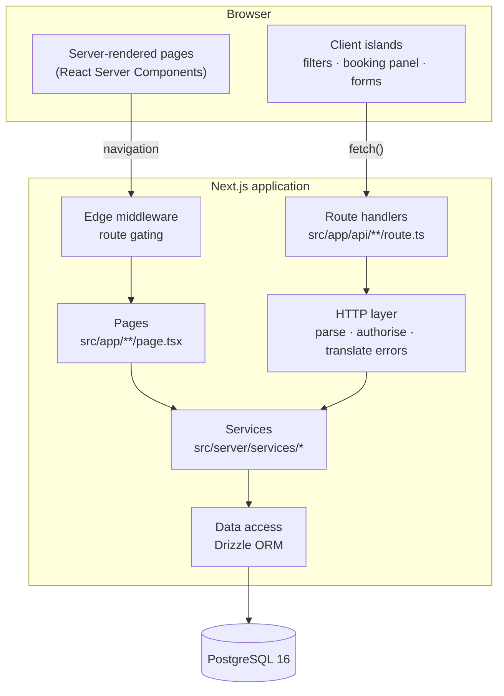
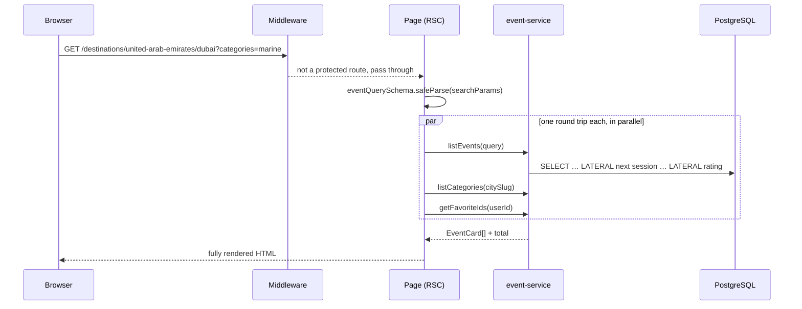
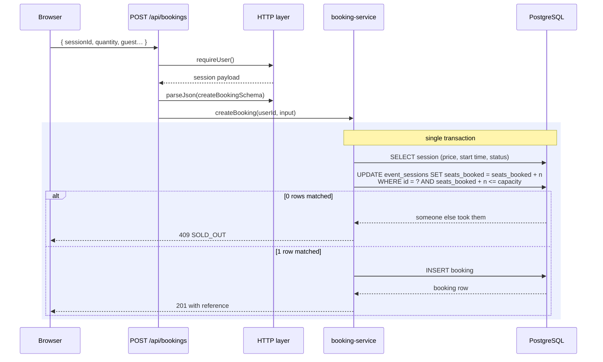
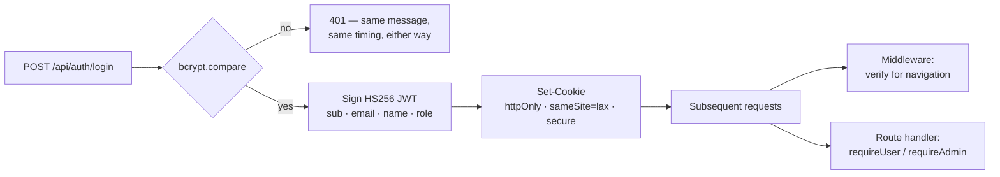
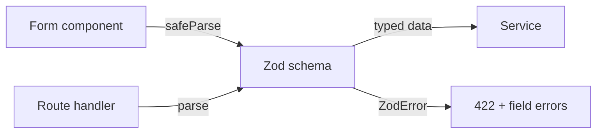
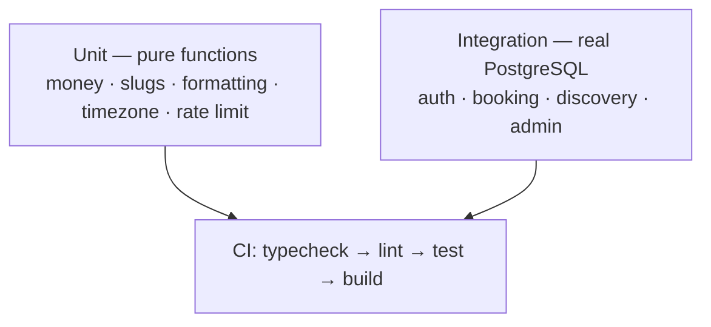

# Architecture

This document explains how Eventora is put together and, more usefully, *why*
it is put together that way. Where a decision has a plausible alternative, the
alternative is named and the trade-off stated.

---

## 1. Shape of the system

Eventora is a single Next.js application with three layers that never leak into
each other:



Two entry points reach the same services:

- **Pages** call services directly. A discovery page is rendered on the server
  with the data already in it — no loading spinner, no client-side waterfall,
  and the HTML is crawlable.
- **Route handlers** wrap the same services in HTTP. They exist for the
  interactions that genuinely happen after load: favouriting, booking,
  cancelling, and everything in the admin dashboard.

The rule that keeps this honest: **a service never imports from `next/server`
and never knows what an HTTP status code is.** It throws a typed `ApiError`;
the HTTP layer decides that `SOLD_OUT` is a 409. That is what makes the same
`createBooking` function callable from a route handler and from the test suite
with no adapter in between.

---

## 2. Directory layout

```
src/
├── app/                        # Routing — pages and API route handlers
│   ├── api/                    #   29 REST endpoints
│   ├── admin/                  #   Dashboard (layout-level role check)
│   ├── destinations/           #   Country → city → discovery
│   ├── events/[slug]/          #   Detail + booking flow
│   └── covers/[seed]/          #   Procedural SVG cover artwork
│
├── components/                 # Presentation only — no data access
│   ├── ui/                     #   Button, Field, Select, Notice
│   └── admin/                  #   Dashboard-specific components
│
├── lib/                        # Pure, isomorphic, no I/O
│   ├── money.ts                #   Minor units, currency formatting
│   ├── format.ts               #   Dates, durations, availability wording
│   ├── timezone.ts             #   Wall time ↔ instant conversion
│   ├── slug.ts                 #   URL slugs
│   ├── covers.ts               #   Deterministic SVG generation
│   └── validation.ts           #   Zod schemas (browser + server)
│
└── server/                     # Server-only — guarded by `server-only`
    ├── db/                     #   Schema, client, migrations, seed
    ├── auth/                   #   Password hashing, JWT sessions
    ├── api/                    #   Error vocabulary, HTTP helpers, rate limit
    └── services/               #   Business logic
```

`src/lib` is the only directory imported by both sides. Everything under
`src/server` starts with `import 'server-only'`, so pulling one into a client
component fails the build rather than shipping database code to the browser.

---

## 3. Request lifecycles

### 3.1 Discovery — a server-rendered page



Two details worth pointing at:

- **`safeParse`, not `parse`.** People edit URLs. A hand-typed `?page=abc`
  degrades to the default view instead of throwing a 500.
- **Two LATERAL subqueries, not N+1.** Each card needs its next bookable
  session and its rating aggregate. Fetching those per card would be 2N extra
  queries for a page of results; a LATERAL join gets them in the same scan.

### 3.2 Booking — the interesting one



The seat claim is the piece of this project most worth defending in a review.
The obvious implementation reads `seats_booked`, compares it in JavaScript, and
then writes. That has a time-of-check-to-time-of-use race: ten concurrent
requests all read *5 seats left*, all decide *1 is fine*, and the session ends up
five seats oversold. Moving the capacity test into the `WHERE` clause makes
PostgreSQL arbitrate — it takes a row lock for the statement and re-evaluates
the predicate against the committed row, so the losers match zero rows and are
told so. `tests/integration/booking.test.ts` fires ten simultaneous bookings at
a five-seat session and asserts exactly five succeed.

---

## 4. Authentication and authorisation



Design points:

- **`httpOnly`** keeps the token unreachable from page scripts, so an XSS bug
  does not become a session compromise.
- **`sameSite=lax`** is the CSRF defence: the cookie is not attached to
  cross-site POSTs, which covers every mutating route without a token dance.
- **Middleware is not the boundary.** It redirects unauthenticated *navigation*
  before a page renders, which is a user-experience improvement. Every route
  handler independently calls `requireUser()` or `requireAdmin()`, because a
  matcher is a routing rule and an attacker calls the API directly.
- **Enumeration is closed on both channels.** A wrong password and an unknown
  address return the identical message, and bcrypt runs against a dummy hash
  when the account does not exist so the two paths take the same time.

The cost of stateless sessions is stated in [SECURITY.md](../SECURITY.md):
changing a password does not invalidate tokens already issued.

---

## 5. Validation

One schema per shape, in `src/lib/validation.ts`, imported by both the form and
the route handler:



Client-side parsing is a convenience — it catches an obvious mistake without a
round trip. The server-side parse is the one that is load-bearing. Because they
are literally the same object, they cannot drift apart, which is the failure
mode of hand-written duplicate rules.

Zod also does the coercion. Form values arrive as strings; `z.coerce.number()`
turns `"3"` into `3` once, at the boundary, rather than every consumer calling
`Number()` and hoping.

---

## 6. Rendering strategy

| Route kind | Strategy | Why |
|---|---|---|
| Landing, discovery, detail | Dynamic server render | Availability changes minute to minute; a cached page that shows a sold-out session as available is worse than a slower one. |
| Filters, booking panel, forms | Client components | They need state and event handlers. Each is a small island inside a server-rendered page. |
| Cover artwork | Route handler, immutable cache | Output is a pure function of the seed, so it is cached for a year. |
| Admin dashboard | Dynamic server render | Statistics must be current, and it is behind auth so caching buys nothing. |

Filter state lives in the URL rather than React state. That is what makes a
filtered view a real address — shareable, bookmarkable, restored by the back
button, and renderable by the server without a client fetch.

---

## 7. Data access

Drizzle is used two ways, deliberately:

- **Query builder** (`db.insert`, `db.update`, `db.select`) for simple,
  single-table operations, where the typed builder is clearer than SQL.
- **`db.execute(sql\`…\`)`** for the read queries with LATERAL joins, filtered
  aggregates and window logic — the ones where an ORM abstraction obscures what
  is actually running.

Both paths emit bound parameters. There is no code path in this repository where
user input is concatenated into a query string, and
`tests/integration/discovery.test.ts` feeds `'; drop table events; --` through
the search box to prove the table survives.

Migrations are plain `.sql` files under `drizzle/`, generated by
`drizzle-kit generate` and applied by `npm run db:migrate`. They are checked in
and readable in a diff, which a schema-push workflow is not.

---

## 8. Design system

Tokens are declared once in `globals.css` under Tailwind v4's `@theme`, and no
component is permitted to invent a colour:

- `brand-*` — the interactive blue, 50 → 950.
- `ink-*` — deep navy for text and dark surfaces.
- `mist-*` — cool neutrals, tuned so they sit under the blues without going
  grey-brown.
- `azure-*` — one bright accent, used sparingly.
- semantic `success` / `warn` / `danger`.

Shadows are blue-tinted rather than black, because a grey shadow over a blue
ground reads as dirt. Focus is defined once globally rather than per component,
so nothing can accidentally ship without a visible focus state.

---

## 9. Testing strategy



The integration tests run against a real PostgreSQL instance, not an in-memory
substitute, because the behaviour under test is exactly what a substitute would
not reproduce: transaction semantics, conditional updates, unique indexes on an
expression, LATERAL joins, `generate_series`. A fake that passes here would
prove nothing about production.

Each test file truncates and builds only the rows it needs. Sharing one large
seeded world across tests couples them — a change to the demo dataset should
never break an assertion about booking concurrency.

---

## 10. What would change at scale

Honest limits of the current design, and the first thing each would need:

| Constraint | Current | Next step |
|---|---|---|
| Session revocation | Stateless JWT | Redis-backed revocation list, or short access tokens + refresh |
| Rate limiting | Per-process memory | Redis, shared across replicas |
| Search | `to_tsvector` + `ILIKE` | Dedicated index (`pg_trgm`, or an external search service) |
| Discovery reads | Query per request | Cache the aggregates; invalidate on booking |
| Images | Procedural SVG | Object storage + a CDN with real photography |
| Payments | None | A PSP, an idempotent order state machine, and webhook reconciliation |
