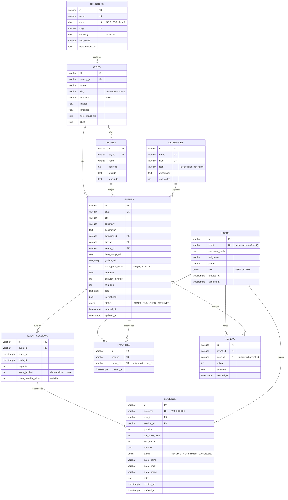

# Database design

PostgreSQL 16, modelled with Drizzle ORM. Ten tables, all constraints enforced
by the database rather than by application code.

---

## Entity–relationship diagram



---

## The five decisions worth defending

### 1. Money is an integer in minor units

`base_price_minor`, `unit_price_minor` and `total_minor` are `INTEGER`, holding
cents or fils. Never `FLOAT`, never `NUMERIC` read into a JavaScript number.

`0.1 + 0.2 !== 0.3` in IEEE-754. A booking platform that adds prices in floating
point charges someone the wrong total eventually, and the bug is invisible in
testing because it only shows in the last decimal place.

The subtlety most implementations miss: **the minor-unit exponent is not always
2.** The Kuwaiti dinar has three decimal places — 1 KWD is 1000 fils — as do the
Bahraini dinar and Omani rial, and the Japanese yen has none. `src/lib/money.ts`
reads the exponent from `Intl.NumberFormat` rather than assuming, so `KWD 18.000`
and `GBP £18.50` are both stored and rendered correctly. This is covered by
`tests/unit/money.test.ts`.

### 2. Availability belongs to the session, not the event

An event is a *description*. A session is a *dated occurrence* with its own
start time, capacity and optional price override. A sunset cruise that runs four
times a week is one `events` row and many `event_sessions` rows.

The alternative — putting a date and capacity on the event itself — makes a
recurring event impossible to represent without duplicating the entire listing
per date, which then has to be kept in sync by hand.

`price_override_minor` is nullable and read with `COALESCE`, so a public holiday
premium is one column on one row rather than a separate pricing table.

### 3. `seats_booked` is denormalised on purpose

Seats sold could be derived with `SUM(quantity)` over non-cancelled bookings.
It is stored instead, because the discovery query needs remaining capacity for
every event on the page, and an aggregate subquery per card is exactly the N+1
that makes a listing page slow.

The cost of denormalising is that the counter can drift. That is handled by
never letting it be written outside a transaction that also writes the booking:

```sql
-- inside a transaction, alongside the INSERT
UPDATE event_sessions
SET    seats_booked = seats_booked + $qty
WHERE  id = $sessionId
  AND  seats_booked + $qty <= capacity
RETURNING id;
```

Zero rows returned means somebody else claimed them first, and the transaction
rolls back. The capacity test is in the `WHERE` clause rather than in JavaScript
precisely so that PostgreSQL — which holds the row lock — arbitrates.
`tests/integration/booking.test.ts` fires ten simultaneous bookings at a
five-seat session and asserts that exactly five succeed.

Cancellation reverses it with `GREATEST(0, seats_booked - quantity)`, so a bug
elsewhere can never drive the counter negative.

### 4. Every foreign key states its own deletion rule

| Relationship | Rule | Reasoning |
|---|---|---|
| `cities → countries` | `CASCADE` | A city cannot outlive its country. |
| `events → cities` | `CASCADE` | Nor can a listing outlive its city. |
| `events → categories` | `RESTRICT` | Deleting a category must not silently delete listings. |
| `events → venues` | `RESTRICT` | Same reasoning. |
| `event_sessions → events` | `CASCADE` | Dates are part of the listing. |
| `bookings → users` | `CASCADE` | Deleting an account removes its bookings. |
| `bookings → event_sessions` | `CASCADE` | A booking cannot outlive its date. |
| `favorites`, `reviews` | `CASCADE` | Engagement is meaningless without its subject. |

Above that, the service layer refuses destructive operations the constraints
would happily allow: deleting an event with paying customers archives it
instead, and a session with active bookings cannot be removed at all. History is
not something to tidy away.

### 5. Identifiers are time-prefixed random strings

`createId()` produces a 24-character value: a base-36 millisecond timestamp
followed by 16 random base-36 characters.

- Against **auto-increment integers**: sequential ids are guessable and leak
  volume — `/bookings/1247` tells you how many bookings exist.
- Against **UUIDv4**: fully random keys scatter inserts across the primary-key
  B-tree, hurting locality. The timestamp prefix keeps freshly created rows
  physically clustered while the random suffix keeps them unguessable.

Booking references are separate and human-facing: `EVT-` plus six characters
from an alphabet with no `0`/`O` or `1`/`I`, so a reference can be read aloud or
copied off a printed confirmation without ambiguity.

---

## Indexes

| Index | Table | Purpose |
|---|---|---|
| `users_email_unique` on `lower(email)` | users | Case-insensitive uniqueness — `Sara@x.com` cannot register twice. |
| `users_role_idx` | users | Administrator lookups. |
| `cities_country_slug_unique` | cities | Two countries may each have a "Springfield"; one country may not. |
| `events_city_status_idx` | events | The discovery query's leading predicate. |
| `events_category_idx` | events | Category filter and facet counts. |
| `events_featured_idx` | events | Landing-page selection. |
| `events_search_idx` (GIN) | events | `to_tsvector('english', title ‖ summary)` for full-text search. |
| `event_sessions_event_start_idx` | event_sessions | The LATERAL "next bookable session" lookup. |
| `event_sessions_start_idx` | event_sessions | Date-window filtering and upcoming-session counts. |
| `bookings_user_created_idx` | bookings | "My bookings", newest first. |
| `bookings_session_idx` | bookings | Capacity reconciliation. |
| `favorites_user_event_unique` | favorites | One heart per user per event, enforced by the database. |
| `reviews_event_user_unique` | reviews | One review per user per event. |

---

## Migrations

```bash
npm run db:generate   # diff the schema, write a new .sql file into drizzle/
npm run db:migrate    # apply everything pending
npm run db:reset      # drop, recreate, re-apply (refuses NODE_ENV=production)
npm run db:seed       # load the demo dataset
```

Migrations are plain SQL, checked into `drizzle/`, applied in filename order and
tracked in `drizzle.__drizzle_migrations`. They are reviewable in a pull request
diff, which a schema-push workflow is not.

---

## Seed data

`npm run db:seed` loads the demo dataset — 5 countries, 15 cities, 81 venues,
10 categories, 89 events and roughly 3,300 sessions.

**Every listing, price, schedule, review and account is fictional**, written for
this project. The countries, cities and venues are real places; nothing else is,
and nothing is scraped from or synchronised with any third-party service. The
disclosure appears in the footer of every page, not only here.

Schedules, capacities and ratings come from a deterministic PRNG seeded by each
event's slug, so the data looks organically varied but is byte-identical on
every machine — a screenshot in the README matches what a reviewer sees after
cloning. Session times are generated as **local wall-clock times in each city's
own time zone** and converted to instants (`src/lib/timezone.ts`), so a Dubai
sunset cruise is stored at the moment that reads 17:30 in Dubai, not 17:30 UTC.
